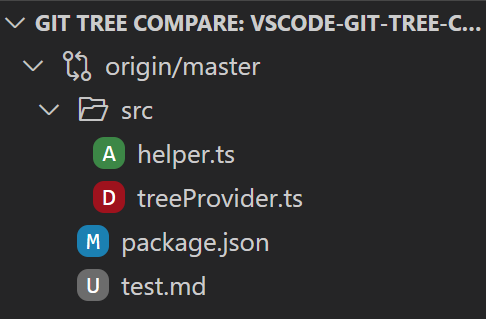
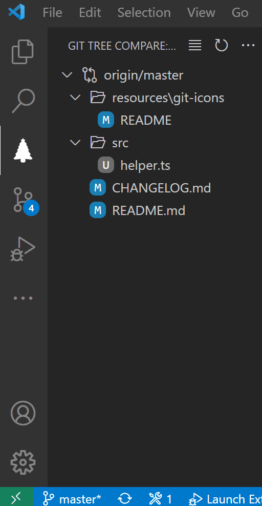

# Git Tree Compare

This [Visual Studio Code](https://code.visualstudio.com/) extension helps you compare your working tree against a branch, tag, or commit in a natural **folder tree structure** or a flat list.

It is perfect for keeping an eye on what your pull request will look like, a **pull request preview** one could say. You don't have to leave your editor at all anymore!

In bigger projects with many files it also provides **context**, it gives you a quick way to figure out which of those files you have been working on in your feature branch. This comes in handy when you work on several branches in parallel, or simply when you forgot where you left off the following day.

## Features

- Working tree comparison against any chosen branch, tag, or commit

- Switch between tree and list view

- Compare in merge or full mode

- Open Changes or Open File

- Automatic refresh on file changes

- Remembers the chosen comparison base per repository

- Log output of all git commands run

## Location

By default, the tree view is located in its own container accessible from the activity bar on the left. However, it can be freely moved to any other location like Source Control or Explorer by dragging and dropping.

## Settings

`gitTreeCompare.diffMode` Determines how the comparison is performed, either by computing a merge base commit first and then comparing against that (equivalent to pull request diffs, default), or by comparing directly to the given base (useful to see the exact diff).

`gitTreeCompare.autoRefresh` Option to turn off automatic refresh. This can be useful for huge repositories when diff operations take a long time. As a work-around, disabling auto refresh also prevents locking issues when running `git rebase` from the integrated terminal (a stand-alone terminal wouldn't cause issues as auto refresh is stopped while the VS Code window is out of focus). A manual refresh can be triggered via the tree menu. Note that automatic refreshs are not triggered by changes to files outside the workspace folder (which can happen when opening a subdirectory of the repository root as workspace folder).

`gitTreeCompare.refreshIndex` Option to turn off refreshing of the git index each time the tree is refreshed. Keeping this enabled avoids superfluous diff entries for cases when only the file modification date is changed, at the cost of an extra git invocation.

`gitTreeCompare.findRenames` Option to turn off rename detection when invoking `git diff-index`. Leaving this option on may have a performance impact for large diffs, especially when `autoRefresh` is enabled.

`gitTreeCompare.openChanges` Option which decides what should happen when clicking on a file in the tree - either open the changes, or the file itself. Default is to open the changes. The other action can always be accessed via the file's context menu.

`gitTreeCompare.root` Determines what the tree root should be when the workspace folder is not the same as the repository root. Default is to make the workspace folder the tree root. Any changes outside the workspace folder are then displayed in a special `/` node.

`gitTreeCompare.includeFilesOutsideWorkspaceRoot` Determines whether to display the special `/` node when the tree root is not the repository root and there are changes outside the workspace folder. Default is to display the `/` node.

`gitTreeCompare.iconsMinimal` Option which enables a compact icon layout where only files have icons, comparable to the Seti file icon theme.

`gitTreeCompare.collapsed` When enabled, shows folders collapsed instead of expanded. NOTE: Changing this option requires restarting VS Code.

`gitTreeCompare.compactFolders` When enabled, compacts (flattens) single-child folders into a single tree element. Useful for Java package structures, for example. May have a performance impact for large diff trees.
