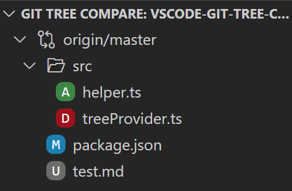
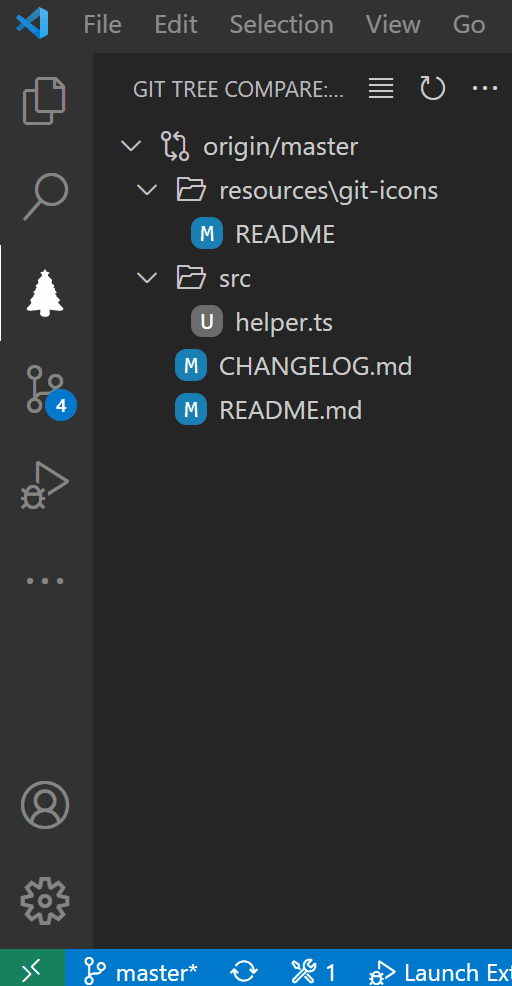

# Git Tree Compare

This [Visual Studio Code](https://code.visualstudio.com/) extension helps you compare your working tree against a branch, tag, or commit in a natural **folder tree structure** or a flat list.

It is perfect for keeping an eye on what your pull request will look like, a **pull request preview** one could say. You don't have to leave your editor at all anymore!

In bigger projects with many files it also provides **context**, it gives you a quick way to figure out which of those files you have been working on in your feature branch. This comes in handy when you work on several branches in parallel, or simply when you forgot where you left off the following day.

## Features

- Working tree comparison against any chosen branch, tag, or commit

- Compare GitHub Pull Requests

- Switch between tree and list view

- Compare in merge or full mode

- Open Changes or Open File

- Open all changes at once in VS Code's multi-file diff editor

- Discard Changes

- Automatic refresh on file changes

- Remembers the chosen comparison base per repository

- Log output of all git commands run

- Search within changed files

- View diffs for linked git worktrees via **Change Worktree...**, switch back via **Switch to Working Tree**
- Optional commits panel to restrict the comparison to a subset of commits

## Location

By default, the tree view is located in its own container accessible from the activity bar on the left. However, it can be freely moved to any other location like Source Control or Explorer by dragging and dropping.

## Git worktrees

If you use [git worktrees](https://git-scm.com/docs/git-worktree), you can switch the tree view to another linked worktree with **Change Worktree...** from the view title bar. To return to your workspace checkout, use **Switch to Working Tree**. It appears as a dedicated button whenever you're viewing a different worktree, and as the first option in the **Change Worktree...** menu.

The worktree does not have to be part of your workspace, as long as git reports it as a linked worktree of the current repository.

When the view shows a node per repository (`multiRepositoryView` with more than one repository in the workspace), use **Change Worktree...** from a repository node's context menu. Each repository node keeps its place in the tree and shows the selected worktree, with the worktree name next to the repository name.

## Compare GitHub Pull Requests

You can quickly view GitHub PR changes directly in VS Code using the **Compare GitHub Pull Request** command:

1. Click the "..." menu button in the Git Tree Compare view title bar
2. Select **Compare GitHub Pull Request...**
3. Enter the GitHub PR URL (e.g., `https://github.com/owner/repo/pull/123`)
4. Authenticate with GitHub if prompted (uses VS Code's built-in GitHub authentication)
5. The extension will:
   - Fetch the PR's head commit
   - Checkout the PR branch as `pr/<number>/<headOwner>/<headRefName>`
   - Compare it against the PR's base branch
   - Display all changes in the tree view

This feature works with both PRs from the same repository and PRs from forks.

## Commits panel

Enable `gitTreeCompare.showCommitsPanel` to show a **Commits** panel below the tree. It lists
the commits between the comparison base and `HEAD`, newest first, with an **Uncommitted Changes**
entry on top.

Unchecking entries restricts the tree to the changes introduced by the remaining ones. The
selection always covers a contiguous range of the timeline, since a range diff cannot leave out
intermediate commits: unchecking something in the middle snaps the rest of the selection to a
contiguous block.

While a subset is selected, the tree compares two commits rather than the working tree, so
discarding changes is unavailable until the full comparison is restored.

The panel follows the repository selected in the tree, and its selection resets whenever the
comparison changes (a new base, or new commits on `HEAD`).

## Settings

`gitTreeCompare.diffMode` Determines how the comparison is performed, either by computing a merge base commit first and then comparing against that (equivalent to pull request diffs, default), or by comparing directly to the given base (useful to see the exact diff).

`gitTreeCompare.autoRefresh` Option to turn off automatic refresh. This can be useful for huge repositories when diff operations take a long time. As a work-around, disabling auto refresh also prevents locking issues when running `git rebase` from the integrated terminal (a stand-alone terminal wouldn't cause issues as auto refresh is stopped while the VS Code window is out of focus). A manual refresh can be triggered via the tree menu. Note that automatic refreshs are not triggered by changes to files outside the workspace folder (which can happen when opening a subdirectory of the repository root as workspace folder).

`gitTreeCompare.findRenames` Option to turn off rename detection when invoking `git diff`. Leaving this option on may have a performance impact for large diffs, especially when `autoRefresh` is enabled.

`gitTreeCompare.openChanges` Option which decides what should happen when clicking on a file in the tree - either open the changes, or the file itself. Default is to open the changes. The other action can always be accessed via the file's context menu.

`gitTreeCompare.root` Determines what the tree root should be when the workspace folder is not the same as the repository root. Default is to make the workspace folder the tree root. Any changes outside the workspace folder are then displayed in a special `/` node.

`gitTreeCompare.includeFilesOutsideWorkspaceRoot` Determines whether to display the special `/` node when the tree root is not the repository root and there are changes outside the workspace folder. Default is to display the `/` node.

`gitTreeCompare.iconsMinimal` Option which enables a compact icon layout where only files have icons, comparable to the Seti file icon theme.

`gitTreeCompare.collapsed` When enabled, shows folders collapsed instead of expanded. NOTE: Changing this option requires restarting VS Code.

`gitTreeCompare.compactFolders` When enabled, compacts (flattens) single-child folders into a single tree element. Useful for Java package structures, for example. May have a performance impact for large diff trees.

`gitTreeCompare.showCheckboxes` When enabled, shows checkboxes next to files and folders, allowing you to tick off items, for example when reviewing changes.

`gitTreeCompare.resetCheckboxOnFileChange` When enabled, automatically resets a file's checkbox when the file is modified after being checked. This ensures that checked files reflect their reviewed state, and any subsequent modifications require re-review. Only effective when `showCheckboxes` is enabled.

`gitTreeCompare.viewMode` Determines whether changed files are shown as a folder tree (`tree`, default) or as a flat list (`list`). The "View as List" and "View as Tree" actions in the tree menu update this setting, so the chosen view is remembered across restarts.

`gitTreeCompare.refSortOrder` Determines how refs (branches, tags) are sorted when changing the comparison base. Default is `committerdate` which sorts by most recently committed first, making it easy to find recently-used branches. Can be set to `alphabetically` for alphabetical sorting.

`gitTreeCompare.openChangesWithDifftool` When enabled, adds an "Open Changes with Difftool" command to the context menu for files. This command opens the changes in the external diff tool configured in Git (e.g., via `git config diff.tool <tool-name>`). Default is disabled. Note: This requires you to have a difftool configured in your Git settings.

`gitTreeCompare.showDiffStats` When enabled, shows insertion/deletion counts (+N -N) next to each file name in the tree view. Default is disabled.

`gitTreeCompare.multiRepositoryView` [EXPERIMENTAL] When enabled and the workspace contains more than one Git repository, the tree shows one expanded section per repository instead of comparing a single active repository. Each repository keeps its own comparison base, filter and checkbox state. Workspaces with a single repository are unaffected. Default is disabled.
